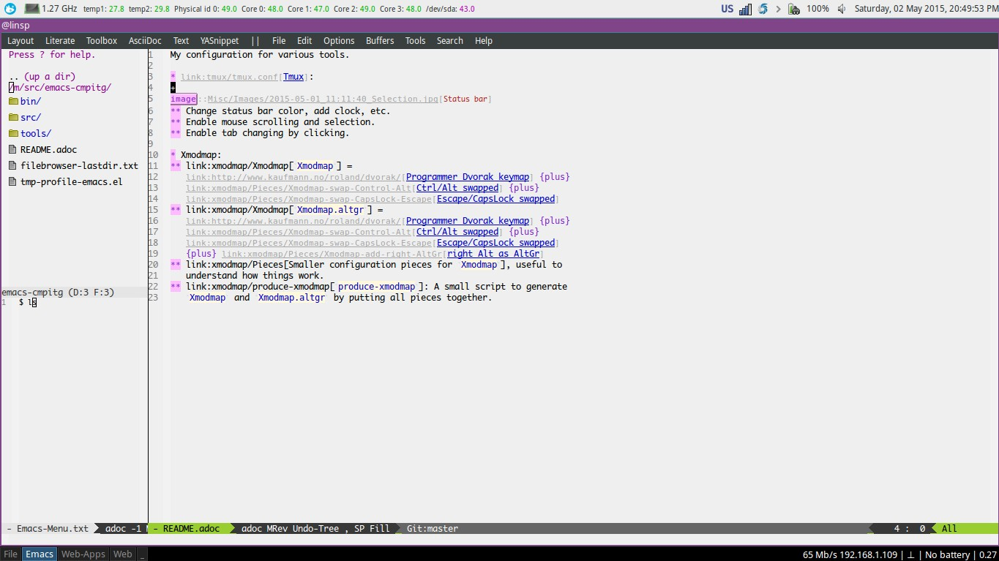
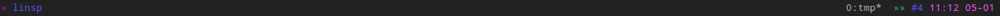

:Author: Nguyễn Hà Dương (cmpitg)
:Email: <cmpitg@gmail.com>
:toc: left
:toclevels: 4
:numbered:
:icons: font
:experimental: true

My configuration for various tools.

== Desktop environment

=== Window manager: link:i3[i3]

* Use kbd:[Super] key as window manager modifier as it makes use of a rarely-used
   modifier:
** kbd:[Super + key]: reserved for text editor.
** kbd:[Super + Alt + key]: desktop/workspace-related actions.
** kbd:[Super + Shift + Alt + key]: screen/monitor-related actions.
** kbd:[Super + Ctrl + key] and kbd:[Super + Shift + key]:
    window/application-related actions.
** kbd:[Ctrl + Alt + Shift + key]: system-wide-related actions.

* Suspend is done with http://pm-utils.freedesktop.org/wiki/[`pm-suspend]`
   (`sudo` {plus} `NOPASSWD` in `sudoers`).

* Lock-screen is managed via http://www.jwz.org/xscreensaver/[XScreenSaver].

=== Keymap

* link:xmodmap/Xmodmap[`Xmodmap`] =
  link:http://www.kaufmann.no/roland/dvorak/[Programmer Dvorak keymap] {plus}
  link:xmodmap/Pieces/Xmodmap-swap-Control-Alt[Ctrl/Alt swapped] {plus}
  link:xmodmap/Pieces/Xmodmap-swap-CapsLock-Escape[Escape/CapsLock swapped]

* link:xmodmap/Xmodmap[`Xmodmap.altgr`] =
  link:http://www.kaufmann.no/roland/dvorak/[Programmer Dvorak keymap] {plus}
  link:xmodmap/Pieces/Xmodmap-swap-Control-Alt[Ctrl/Alt swapped] {plus}
  link:xmodmap/Pieces/Xmodmap-swap-CapsLock-Escape[Escape/CapsLock swapped]
  {plus} link:xmodmap/Pieces/Xmodmap-add-right-AltGr[right Alt as AltGr]

* link:xmodmap/Pieces[Smaller configuration pieces for `Xmodmap`], useful to
  understand how things work.

* link:xmodmap/produce-xmodmap[`produce-xmodmap`]: A small script to generate
  `Xmodmap` and `Xmodmap.altgr` by putting all pieces together.

=== Panel: link:xfce4/xfconf/xfce-perchannel-xml/xfce4-panel.xml[XFCE 4 panel]

* Small application launcher top-left.

* Hardware status:
** CPU frequency
** CPU temperature
** HDD temperature

* With
** Notification area
** XFCE 4 power management applet
** XFCE 4 mixer applet
** Clock applet, display full date and time

== Console

=== link:tmux/tmux.conf[Tmux]

* Change status bar color, add clock, etc.
* Enable mouse scrolling and selection.
* Enable tab changing by clicking.
